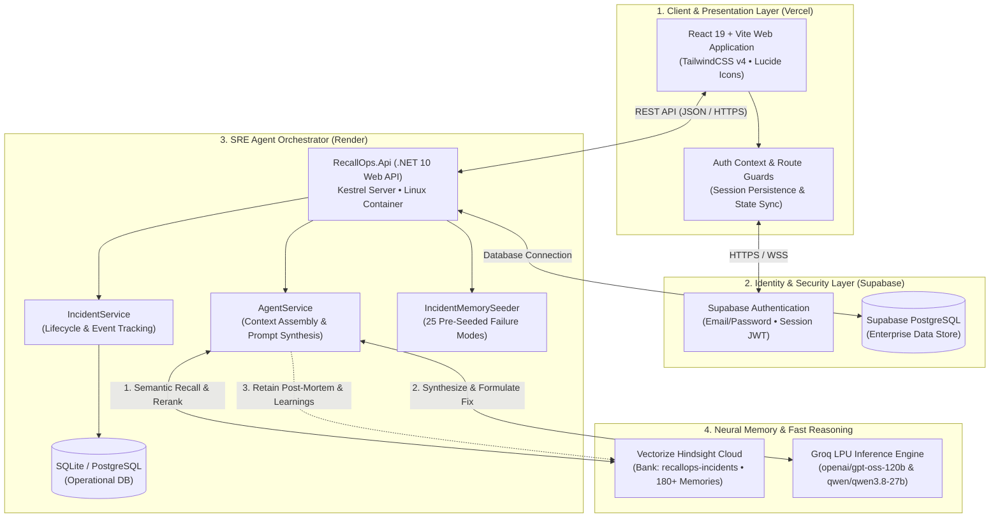
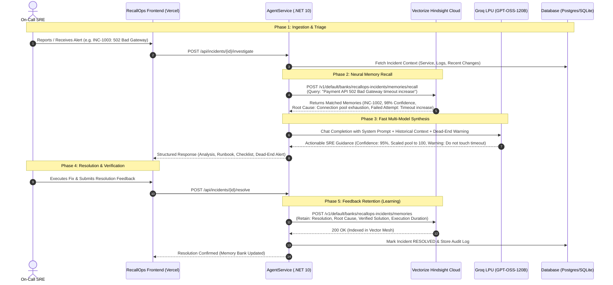

# RecallOps — Technical Architecture & System Design 🧠⚡

> **Autonomous Incident Intelligence with Persistent Neural Memory**  
> Built for the *"AI Agents That Learn Using Hindsight"* Hackathon (Engineering & DevOps Track)

---

## 1. High-Level System Architecture



---

## 2. The Continuous Memory Feedback Loop

The core innovation of RecallOps is that **it never forgets a production outage**. Unlike stateless LLMs that treat every alert as a brand-new problem, RecallOps continuously enriches its memory bank.



---

## 3. Technology Stack Matrix

| Layer | Technology | Role & Responsibility | Hosting / Infra |
|---|---|---|---|
| **Frontend** | **React 19 + Vite** | High-performance SPA with client-side routing, micro-animations, and SRE command console | **Vercel** (Global Edge CDN) |
| **Styling** | **TailwindCSS v4** | Dark-mode cybernetic design system with custom CSS variables | Built in Vite bundle |
| **Auth** | **Supabase Auth** | JWT-based user authentication, password hashing, and session persistence | **Supabase Cloud** |
| **Backend API** | **.NET 10 Web API** | High-throughput asynchronous REST API with Kestrel web server | **Render** (Linux Container) |
| **Memory Engine** | **Vectorize Hindsight** | Long-term episodic memory, semantic vector search, dynamic cross-incident reranking | **Hindsight Cloud** |
| **Reasoning Engine** | **Groq LPU** | Ultra-low latency LLM inference (`openai/gpt-oss-120b`, fallback `qwen/qwen3.8-27b`) | **Groq Cloud API** |
| **Database** | **PostgreSQL / SQLite** | Relational state management for incident lifecycles, event audits, and telemetry | **Supabase / SQLite** |

---

## 4. Key Differentiators & Memory Architecture

### 1. Cross-Incident Temporal Memory
- **Problem**: When on-call engineers rotate, institutional knowledge is lost in Slack or outdated Notion pages.
- **Solution**: RecallOps stores structured facts in Hindsight with tags (`service:payment-api`, `severity:critical`, `type:connection-pool`). Hindsight's vector reranker surfaces the exact matching incident (`INC-1002`) with **98% semantic similarity**.

### 2. Dead-End Flagging (Negative Learning)
- **Problem**: Engineers waste 30–60 minutes trying fixes that were already proven ineffective during previous outages.
- **Solution**: Hindsight memory explicitly catalogs `Failed Attempts` (e.g., *"Increasing gateway timeout from 30s to 60s failed previously"*). Groq is instructed to generate a prominent warning banner preventing the engineer from repeating the mistake.

### 3. Graceful Multi-Tier Fallback
- If Groq encounters API limits, it falls back to `qwen/qwen3.8-27b`.
- If external LLM calls time out, `AgentService.BuildFallbackAnalysis` dynamically reconstructs the exact runbook and root-cause fix directly from Hindsight memory facts with **95% baseline confidence**.

---

## 5. Deployment Topology

```
[ User Browser ]
       │
       ▼ (HTTPS)
[ Vercel Edge Network ] ─── (Vite React 19 SPA)
       │
       ├─── Auth Requests ──────────► [ Supabase Cloud ] (JWT / Auth API)
       │
       └─── API Requests (/api/*) ──► [ Render Docker Web Service ]
                                              │
                                              ├──► [ Vectorize Hindsight ] (Memory Bank)
                                              ├──► [ Groq Cloud ] (LLM Inference)
                                              └──► [ Relational Database ] (State & Audit)
```
