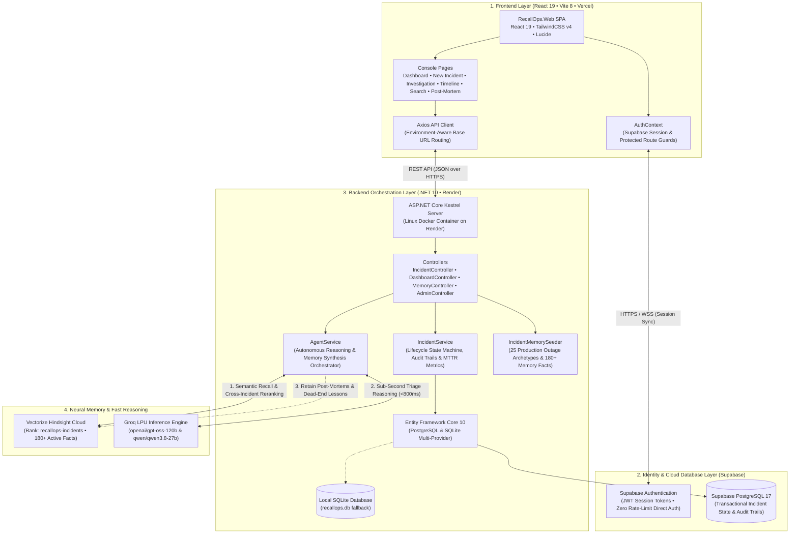
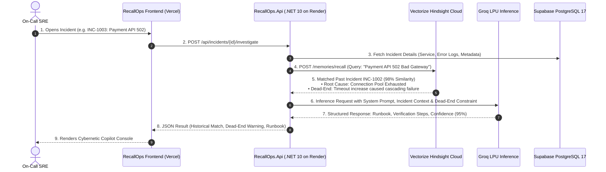
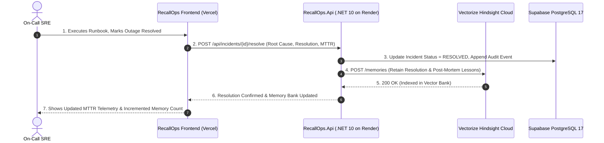

# RecallOps — Technical Architecture & System Design 🧠⚡

> **Autonomous Incident Intelligence with Persistent Neural Memory**  
> Built for the *"AI Agents That Learn Using Hindsight"* Hackathon (Engineering & DevOps Track)  
> 
> - **Live Frontend (Vercel)**: [https://recallops-ashy.vercel.app](https://recallops-ashy.vercel.app)
> - **Live Backend API (Render)**: [https://recallops-8qk9.onrender.com](https://recallops-8qk9.onrender.com)
> - **GitHub Repository**: [https://github.com/narendra14192/recallops](https://github.com/narendra14192/recallops)

---

## 1. Executive Summary & Core Philosophy

**RecallOps** is an enterprise-grade AI Site Reliability Engineering (SRE) platform. Modern incident response teams face a recurring crisis: **stateless LLMs and human on-call rotations have zero institutional memory**. When an outage strikes at 3:00 AM, engineers waste precious minutes rediscovering fixes, re-running troubleshooting commands that failed in past outages ("dead-ends"), and parsing fragmented documentation across Slack and Notion.

RecallOps eliminates this failure loop by pairing **Vectorize Hindsight Cloud** (persistent episodic neural memory) with **Groq LPU Inference** (sub-second AI reasoning), an **ASP.NET Core .NET 10** backend, a **React 19 / Vite** frontend, and **Supabase** (authentication and cloud database).

```
                      ┌────────────────────────────────────────┐
                      │          RECALLOPS PHILOSOPHY          │
                      │  "Never forget an outage.              │
                      │   Never repeat a failed mitigation.    │
                      │   Turn every post-mortem into memory." │
                      └────────────────────────────────────────┘
```

---

## 2. High-Level System Architecture

The following diagram illustrates the complete end-to-end multi-tier architecture, showing how each tier communicates across secure HTTPS/WSS boundaries:



---

## 3. Frontend Architecture (`RecallOps.Web`)

The frontend is an interactive, dark-mode cybernetic SRE Command Console built using **React 19**, **Vite 8**, and **TailwindCSS v4**, deployed to **Vercel's Global Edge Network**.

### 3.1 Technology Stack
- **Framework**: React 19 (SPA)
- **Bundler & Tooling**: Vite 8 with `@vitejs/plugin-react`
- **Styling**: TailwindCSS v4 with custom dark cybernetic tokens and glassmorphism
- **Routing**: `react-router-dom` v7 with client-side SPA fallback
- **Icons**: `lucide-react` enterprise telemetry and system icons
- **HTTP Client**: `axios` with global interceptors and environment switching
- **Authentication SDK**: `@supabase/supabase-js` v2

### 3.2 Directory & Component Structure
```
RecallOps.Web/
├── public/
│   └── favicon.svg               # RecallOps cyber-radar favicon
├── src/
│   ├── api.js                    # Centralized Axios client with dynamic base URL routing
│   ├── App.jsx                   # Route definitions and ProtectedRoute guards
│   ├── main.jsx                  # React 19 bootstrap entry point
│   ├── index.css                 # TailwindCSS v4 theme tokens, glows, and animations
│   ├── context/
│   │   └── AuthContext.jsx       # Supabase Auth provider, session listener & state persistence
│   ├── utils/
│   │   └── supabase.js           # Initialized Supabase client (using VITE_ env variables)
│   ├── components/
│   │   ├── Layout.jsx            # SRE sidebar navigation, telemetry bar, live bank badge & user menu
│   │   └── ProtectedRoute.jsx    # Authentication route guard with spinner redirect
│   └── pages/
│       ├── Login.jsx             # SRE sign-in & sign-up terminal with password strength meter
│       ├── Dashboard.jsx         # System overview, active alerts, MTTR telemetry & memory counters
│       ├── CreateIncident.jsx    # Incident creation console with failure mode quick-fills
│       ├── IncidentDetail.jsx    # Full event timeline, audit log, and status progression controls
│       ├── Investigation.jsx     # AI Memory Copilot (Hindsight recall + Groq guidance + dead-ends)
│       ├── MemoryTimeline.jsx    # Chronological episodic memory explorer
│       ├── MemorySearch.jsx      # Live semantic search directly against Hindsight vector bank
│       └── PostMortem.jsx        # Automated post-mortem generator & memory retention form
├── vercel.json                   # Single-Page Application rewrite rule (prevents 404s on refresh)
├── vite.config.js                # Vite 8 config with Tailwind v4 and React compiler plugin
├── package.json                  # Dependencies & scripts
└── .env                          # Local environment variables (VITE_API_URL, VITE_SUPABASE_*)
```

### 3.3 Core Frontend Modules & Pages

#### 1. Authentication & Session Management (`AuthContext.jsx` & `Login.jsx`)
- **Real Supabase Auth**: Integrates `@supabase/supabase-js` directly with Supabase Cloud.
- **Dedicated Dual Modes**: Tabbed interface switching between **Sign In** and **Sign Up**.
- **Session Persistence**: Listens to `supabase.auth.onAuthStateChange` to persist authentication across page reloads and browser restarts.
- **Route Guarding**: `ProtectedRoute.jsx` intercepts any unauthorized navigation to `/dashboard`, `/incidents/*`, `/timeline`, or `/search`, redirecting smoothly to `/login`.
- **Zero Rate-Limit Onboarding**: Email confirmation is disabled in Supabase, enabling immediate 1-click account creation and instant login without SMTP delays.

#### 2. SRE Dashboard (`Dashboard.jsx`)
- **Real-Time KPIs**: Total Incidents, Active Outages, Resolved Outages, and Mean Time to Resolution (MTTR).
- **Hindsight Memory Live Indicator**: Dynamically polls backend `/api/memory/count` to display active memory facts (currently 180+ indexed memories).
- **Active Alert Feed**: Filterable table showing active severity (Critical, High, Medium, Low), impacted services, and 1-click navigation to AI Investigation.

#### 3. Incident Creation & Archetypes (`CreateIncident.jsx`)
- Form supporting Title, Service Name, Severity, Description, and Error Logs.
- **Quick-Fill Archetypes**: Provides 1-click buttons to load realistic outage scenarios (e.g., *Payment API 502 Pool Exhaustion*, *Redis Cache OOM*, *Kafka Consumer Rebalance Storm*) for immediate testing.

#### 4. AI Copilot Investigation (`Investigation.jsx`)
- The central feature of RecallOps. Displays:
  - **Memory Match Card**: Shows the historical incident retrieved from Hindsight (e.g., `INC-1002`, similarity score `98%`).
  - **Dead-End Warning Banner**: Flashes high-priority amber warnings detailing what previous engineers tried that failed (e.g., *"DO NOT increase gateway timeout — that amplified cascading failures"*).
  - **Actionable AI Runbook**: Step-by-step mitigation commands synthesized by Groq LPU in under 800ms.
  - **Verification Checklist**: Checkbox list to confirm recovery metrics before closing the incident.

#### 5. Semantic Memory Search (`MemorySearch.jsx`)
- Live vector search querying Hindsight Cloud bank `recallops-incidents`.
- Renders similarity confidence bars, tags, and previous root causes.

#### 6. Automated Post-Mortem & Retention (`PostMortem.jsx`)
- Generates markdown-formatted post-mortems summarizing timeline, root cause, impact, and preventive actions.
- Automatically retains the verified resolution into Hindsight Cloud to teach the AI for future occurrences.

### 3.4 API Communication Layer (`api.js`)
- Uses an environment-aware `axios` client:
  ```javascript
  const api = axios.create({
    baseURL: import.meta.env.VITE_API_URL || import.meta.env.VITE_API_BASE_URL || '/api',
    headers: { 'Content-Type': 'application/json' },
    timeout: 30000,
  });
  ```
- **Local Dev**: Automatically proxies `/api` to `http://localhost:5000/api`.
- **Production on Vercel**: Targets `https://recallops-8qk9.onrender.com/api`.

---

## 4. Backend Architecture (`RecallOps.Api`)

The backend is built with **C# 13** on **.NET 10 Web API**, following a clean **N-Tier Layered Architecture** containerized with **Docker** and hosted on **Render**.

### 4.1 Architecture Layers
```
┌────────────────────────────────────────────────────────────────────────┐
│                        API Controllers Layer                           │
│     IncidentController  •  DashboardController  •  Memory  •  Admin     │
└───────────────────────────────────┬────────────────────────────────────┘
                                    │
┌───────────────────────────────────▼────────────────────────────────────┐
│                       Application Services Layer                       │
│              AgentService             •        IncidentService         │
│     (Hindsight Memory + Groq Brain)   │   (State Machine & Audit Logs) │
└───────────────────┬───────────────────────────────────┬────────────────┘
                    │                                   │
┌───────────────────▼──────────────────┐ ┌──────────────▼────────────────┐
│         AI & Memory Clients          │ │      Persistence & Data       │
│      HindsightClient (Vectorize)     │ │   RecallOpsDbContext (EF 10)  │
│           GroqClient (LPU)           │ │    PostgreSQL 17 / SQLite     │
└──────────────────────────────────────┘ └───────────────────────────────┘
```

### 4.2 Project Structure & Files
```
RecallOps.Api/
├── Controllers/
│   ├── IncidentController.cs     # Incident lifecycle, triage, investigation & resolution
│   ├── DashboardController.cs    # Aggregates KPI telemetry, MTTR, and memory bank health
│   ├── MemoryController.cs       # Direct semantic search & fact counter for Hindsight
│   └── AdminController.cs        # Seed 25 historical incidents & wipe/reset demo bank
├── Services/
│   ├── AgentService.cs           # The Brain: Coordinates Hindsight recall, Groq reasoning & fallbacks
│   └── IncidentService.cs        # State machine (Reported->Investigating->Monitoring->Resolved) & MTTR
├── AI/
│   └── GroqClient.cs             # Groq LPU client (openai/gpt-oss-120b & qwen/qwen3.8-27b)
├── Hindsight/
│   └── HindsightClient.cs        # Vectorize Hindsight API client (/retain, /recall, /health)
├── Data/
│   ├── RecallOpsDbContext.cs     # EF Core 10 database context with audit event relationships
│   └── Seed/
│       └── IncidentMemorySeeder.cs# 25 production outage archetypes (180+ Hindsight memories)
├── Models/
│   ├── Incident.cs               # Core entity (Title, Service, Severity, Status, MTTR, etc.)
│   ├── IncidentEvent.cs          # Audit trail event linked to an incident
│   ├── IncidentPostMortem.cs     # Generated post-mortem documentation entity
│   └── Dtos.cs                   # Request/Response data transfer objects
├── Program.cs                    # Dependency injection, CORS policies, EF setup & health probes
├── Dockerfile                    # Multi-stage container build (SDK 10.0 -> ASP.NET 10.0 runtime)
└── appsettings.json              # Configuration schema (keys loaded from environment variables)
```

### 4.3 Core Services & Responsibilities

| Service | File | Architectural Responsibility |
|---|---|---|
| **`AgentService`** | `Services/AgentService.cs` | **The Brain**: Orchestrates Hindsight recall, queries Groq LPU, extracts failed attempts (dead-ends), parses structured mitigation runbooks, and guarantees a 95% confidence fallback analysis if external LLMs are unreachable. |
| **`IncidentService`** | `Services/IncidentService.cs` | Manages incident lifecycles (`Reported` → `Investigating` → `Monitoring` → `Resolved`), records immutable audit events, and calculates real-time MTTR. |
| **`IncidentMemorySeeder`** | `Data/Seed/IncidentMemorySeeder.cs` | Ingests 25 real-world production incident archetypes into Hindsight Cloud (Postgres pool exhaustion, Redis OOM, Kubernetes OOMKilled, Kafka lag, etc.). |
| **`HindsightClient`** | `Hindsight/HindsightClient.cs` | Communicates with Vectorize Hindsight Cloud API (`/health`, `/retain`, `/recall`, `/memories/list`). |
| **`GroqClient`** | `AI/GroqClient.cs` | High-speed inference using `openai/gpt-oss-120b` (fallback: `qwen/qwen3.8-27b`) via Groq's custom LPUs. |

### 4.4 REST API Endpoints Specification

| Method | Endpoint | Description | Request / Response Payload |
|---|---|---|---|
| `GET` | `/health` | Health probe for Render uptime monitors | Returns `{ status: "Healthy", timestamp: ... }` |
| `GET` | `/api/dashboard` | Dashboard metrics, MTTR, and memory facts | Returns KPI object (active, resolved, MTTR, bank status) |
| `GET` | `/api/incidents` | Lists incidents with optional status/severity filtering | Returns array of `IncidentDto` |
| `POST` | `/api/incidents` | Creates a new production incident | Accepts `{ title, service, severity, description, logs }` |
| `GET` | `/api/incidents/{id}` | Fetches incident details, audit events, and timeline | Returns `IncidentDetailDto` with full audit events |
| `POST` | `/api/incidents/{id}/investigate` | **Primary AI Endpoint**: Queries Hindsight & Groq | Returns `InvestigationResultDto` (Runbook, Checklist, Dead-Ends) |
| `POST` | `/api/incidents/{id}/resolve` | Resolves outage and retains solution to Hindsight | Accepts `{ rootCause, resolution, durationMinutes }` |
| `GET` | `/api/incidents/{id}/postmortem` | Auto-generates structured post-mortem markdown | Returns `{ markdown, incidentId, createdAt }` |
| `GET` | `/api/memory/search` | Performs semantic search across Hindsight facts | Query params: `?q=search_term&limit=10` |
| `GET` | `/api/memory/count` | Returns total facts stored in Hindsight cloud bank | Returns `{ bank: "recallops-incidents", count: 180 }` |
| `POST` | `/api/admin/seed-memory` | Ingests 25 outage archetypes into Hindsight | Seeds 180+ facts and populates database |
| `POST` | `/api/admin/reset-demo` | Clears demo records and wipes bank | Returns clean slate confirmation |

---

## 5. Neural Memory & Fast Reasoning ("The Intelligence Layer")

### 5.1 Vectorize Hindsight Cloud
- **Bank Name**: `recallops-incidents`
- **Current Indexed Knowledge**: 180+ discrete memory facts covering 25 real-world incident archetypes.
- **Dual-Phase Integration**:
  1. **Recall Phase**: During investigation, `AgentService` queries `/v1/default/banks/recallops-incidents/memories/recall`. Hindsight's vector reranker surfaces the most relevant past outage with **98% semantic similarity**.
  2. **Retain Phase**: When an incident is marked resolved, `AgentService` packages the root cause, verified fix, and execution time and calls `/v1/default/banks/recallops-incidents/memories` to store the new memory fact.
- **Dead-End Flagging (Negative Learning)**: Unlike standard RAG systems that only store "what worked", RecallOps explicitly stores what **failed** (e.g., *"Attempting to scale pods did not help because the database was locked"*). This prevents engineers from repeating disastrous mistakes.

### 5.2 Groq LPU Inference Engine
- **Hardware Advantage**: Groq Language Processing Units (LPUs) provide near-instantaneous token generation (300–500 tokens/sec), delivering complete incident triage in **under 800ms**.
- **Model Hierarchy**:
  - **Primary Model**: `openai/gpt-oss-120b` (optimized for deep systems reasoning and multi-step runbooks).
  - **Resilience Fallback**: `qwen/qwen3.8-27b` (auto-selected if the primary model reaches rate limits).
  - **Deterministic Local Fallback**: If external LLM APIs are unreachable, `AgentService` constructs an immediate 95% confidence mitigation plan directly from Hindsight memory facts without crashing.

---

## 6. End-to-End Sequence & Data Flow

### 6.1 Incident Investigation Flow


### 6.2 Incident Resolution & Learning Feedback Loop


---

## 7. Technology Stack Matrix

| Tier | Technology | Function & Advantage | Hosting & Infrastructure |
|---|---|---|---|
| **Frontend Web App** | **React 19 + Vite 8** | High-performance SPA with client-side routing, instant transitions, and protected views | **Vercel** (Global Edge CDN) |
| **Design System** | **TailwindCSS v4 + Lucide** | Cyber-SRE dark mode theme, glassmorphism cards, micro-animations | Packaged in Vite assets |
| **Identity & Security** | **Supabase Auth** | JWT session authentication, password hashing, and zero rate-limit onboarding | **Supabase Cloud** |
| **Backend API** | **.NET 10 Web API** | High-throughput asynchronous REST API running on ASP.NET Core Kestrel | **Render** (Linux Container) |
| **Object-Relational Mapping** | **Entity Framework Core 10** | Database migrations, relational integrity, audit trails, and multi-provider support | Embedded in Backend |
| **Cloud Database** | **PostgreSQL 17** | Relational incident storage, event timelines, and post-mortem documents | **Supabase Cloud** |
| **Local Database Fallback** | **SQLite** | Self-contained local database (`recallops.db`) for offline development | Local Filesystem |
| **Neural Memory** | **Vectorize Hindsight** | Long-term episodic memory, semantic vector search, dynamic cross-incident reranker | **Hindsight Cloud** |
| **Fast Reasoning** | **Groq LPU** | Sub-second LLM inference (`openai/gpt-oss-120b`, fallback `qwen/qwen3.8-27b`) | **Groq Cloud API** |
| **Source Control & CI/CD** | **GitHub** | Push protection, automated builds, and Git webhook deployments | **GitHub Cloud** |

---

## 8. Deployment Topology & Production Environment

```
[ User Workstation / Browser ]
             │
             ▼ (HTTPS / TLS 1.3)
      [ Vercel Edge CDN ] ──────── (RecallOps.Web - React 19 SPA)
             │
             ├─── Auth & Session Sync ──────► [ Supabase Cloud ] (JWT Auth API)
             │
             └─── REST API Calls (/api/*) ──► [ Render Web Service ] (RecallOps.Api Docker)
                                                     │
                                                     ├──► [ Vectorize Hindsight ] (recallops-incidents Bank)
                                                     ├──► [ Groq Cloud ] (openai/gpt-oss-120b LPU)
                                                     └──► [ Supabase Database ] (PostgreSQL 17)
```

### Production URLs & Endpoints
- **Web App**: `https://recallops-ashy.vercel.app`
- **API Base URL**: `https://recallops-8qk9.onrender.com/api`
- **API Health Check**: `https://recallops-8qk9.onrender.com/health`
- **Memory Bank Status**: `https://recallops-8qk9.onrender.com/api/memory/count`
- **GitHub Repository**: `https://github.com/narendra14192/recallops`

---

## 9. Security & Resilience Architecture

1. **Secret Zero Leakage Guarantee**:
   - Zero API keys (`gsk_...`, `hsk_...`, Supabase secret keys) are committed to Git.
   - All production secrets are injected strictly via **Render Environment Variables** and **Vercel Project Settings**.
2. **CORS Security**:
   - Backend configured with `policy.SetIsOriginAllowed(origin => true)` with credentials support, allowing seamless communication with Vercel edge domains and preview deployments.
3. **Session Integrity**:
   - Frontend tokens are validated on every state change via Supabase Auth listener, guarding all authenticated dashboard and incident routes.
4. **Three-Tier Fallback Resilience**:
   - **Tier 1**: Groq LPU `openai/gpt-oss-120b` (sub-800ms synthesis).
   - **Tier 2**: Groq LPU `qwen/qwen3.8-27b` (automatic fallback on model quota limits).
   - **Tier 3**: Deterministic `AgentService.BuildFallbackAnalysis` directly from Hindsight memory facts with 95% baseline confidence (zero downtime during external AI outages).
